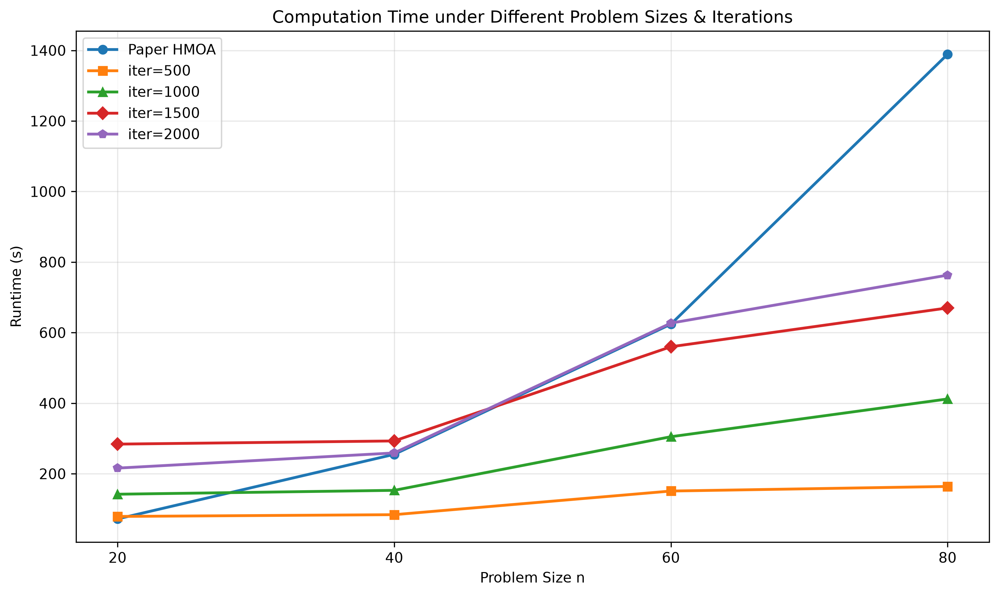

# Weekly Progress Log

> Update this file **every week**. Add a new entry at the top for each week.
> This is the first thing we check during review. Keep it honest and specific — it also feeds your attendance record (Rule 1).

**How to use:** copy the *Week template* block below for each new week. Newest week goes at the top.

---

## Week template — copy me

### Week N — YYYY-MM-DD

**Attended this week's meeting:** Yes / No (if No, did you email leave? Yes / No)

**Progress this week**
- _What did you actually do / finish?_

**Challenges & blockers**
- _What got in the way? What are you stuck on?_

**Next steps**
- _What will you do next week?_

**Hours spent (optional):** _e.g. 6h_

**Links (optional):** _commits, notebooks, docs, datasets..._

---

<!-- =================  YOUR ENTRIES BELOW  ================= -->

### Week 1 — 2026-06-10

**Attended this week's meeting:** Yes

**Progress this week**
- Set up repository from the FURP template.
- Configured GitHub authentication (gh auth login) for push access.
- Initialized `/src` directory structure: `data/`, `experiments/`, `results/`.
- Added `.gitignore` fix to allow tracking `.gitkeep` in `data/` directories.
- Implemented and pushed OR-Tools VRP baseline solver (`src/experiments/vrp_ortools_simple.py`):
  - 4 vehicles, 20 customers, capacity 100
  - Total distance: 530 (feasible solution)
  - Runtime: ~5 seconds
  - Generated route visualization (`src/results/vrp_ortools_route.png`)
- Exported and committed environment config files:
  - `requirements.txt` (pip freeze)
  - `environment.yml` (conda env export)
- Verified the solver runs successfully in `vrp_env312` (Python 3.12.13, OR-Tools 9.15).

**Challenges & blockers**
- `.gitignore` initially blocked `data/` directories entirely — fixed with `data/**` + negation rule for `.gitkeep`.
- None blocking so far.

**Next steps**
- Research truck-drone collaborative delivery literature.
- Design EVRP-TW mathematical model formulation.
- Implement electric vehicle constraints (charging stations, battery capacity) on top of the baseline VRP solver.

**Hours spent (optional):** 4h

**Links (optional):**
- Repository: https://github.com/yawn123456/FURP-2026-Jiakai-YING-Ground-Air-Collaborative-EVRP-TW-Hybrid-Optimization-for-Truck-Drone-Delivery
- OR-Tools VRP solver: `src/experiments/vrp_ortools_simple.py`
- Route visualization: `src/results/vrp_ortools_route.png`

### Week 2 — 2026-06-23

**Attended this week's meeting:** No (email leave: No)

**Progress this week**
- Reproduced the HMOA (Hybrid Multi-Objective Optimization Approach) by Luo et al. (IEEE TITS, 2022) for collaborative truck-drone routing, integrating NSGA-II with Pareto Local Search (PLS).
- Validated the algorithm on 20-customer and 50-customer instances, achieving 30 Pareto-non-dominated solutions on the 20-customer case (best cost: 3,133.99).
- Fixed a bug in the initialization logic and optimized performance, yielding a **10.6× speedup** (13.89s for 20 customers, 37.68s for 50 customers).
- Completed a comparative analysis of POMO (learning-based), GA/EA (evolutionary), and OR (exact) methods across objective quality, efficiency, constraint flexibility, scalability, and implementation complexity.
- Analyzed main difficulties when adding energy and time window constraints: non-linear energy modeling, charging decision coupling, hard time window feasibility, and truck-drone temporal coordination.
- Drafted insights and framework adaptations for extending the approach to EVRP-TW, including a proposed 3-part chromosome (truck route | charging station indices | charging ratio), segment-by-segment energy evaluation, E-Insertion heuristic for initial solutions, and a constraint repair priority chain (Connectivity → Time windows → Energy → Capacity).

**Challenges & blockers**
- **Non-linear coupling between constraints** (energy × time windows × route topology) causes combinatorial explosion — enabling 3 drones simultaneously reduced feasible flight space by over 60% purely due to coordination constraints.
- **Hard time window constraints** yield very few feasible random initial solutions; the paper avoids this via flexible time windows with satisfaction decay, but extending to hard windows requires time-window-aware initialization.
- **State-dependent energy evaluation** — swapping two nodes requires re-evaluating the entire path's energy feasibility, making neighborhood operators expensive.
- **Charging decision coupling** — location, duration, and strategy are strongly coupled with routing, causing search space explosion.

**Next steps**
- Extend the HMOA framework to EVRP-TW: replace "drone flights" with "charging station visits" in the chromosome representation.
- Implement the proposed EVRP-TW chromosome (3-part encoding) and energy-aware Repair operator.
- Develop the E-Insertion heuristic for charging-station-aware initial solution construction.
- Benchmark against OR-Tools (CP-SAT) on small instances (≤20 customers) for optimality reference.
- Explore AM (Attention Model) for learning charging station selection within Repair for large-scale instances (≥200 customers).

**Hours spent (optional):** ---

**Links (optional):** _Luo et al., IEEE TITS 2022 — HMOA for collaborative truck-drone routing_

---

*Last updated: 2026-06-23*

### Week 3 — 2026-06-30
**Generated:** 2026-06-30 16:49

**Parameters:** pop=200, drones=3, wbl=wbu=0.2, pc=0.8, pm=0.3, kmax=5, runs=15

**Instances:** Dumas et al. (1995) TSPTW, w=80, n=20/40/60/80 x5 = 20

**Comparison:** HMOA vs HMOA-noLS

---

## 1. C-metric Detailed Results

| Instance | Paper C(H,N) | iter=500 | iter=1000 | iter=1500 | iter=2000 |
|----------|-------------|----------|-----------|-----------|-----------|
| n20w80_001 | 0.527 | 0.992+ | 0.989+ | 0.986+ | 0.988+ |
| n20w80_002 | 0.675 | 0.797+ | 0.997+ | 0.929+ | 0.996+ |
| n20w80_003 | 0.496 | 0.867+ | 0.794+ | 0.799+ | 0.726+ |
| n20w80_004 | 0.482 | 0.928+ | 0.990+ | 0.997+ | 0.998+ |
| n20w80_005 | 0.817 | 0.587- | 0.527- | 0.408- | 0.524- |
| n40w80_001 | 0.543 | 0.808+ | 0.869+ | 0.934+ | 0.740+ |
| n40w80_002 | 0.527 | 0.864+ | 0.930+ | 0.801+ | 0.927+ |
| n40w80_003 | 0.489 | 0.889+ | 1.000+ | 0.866+ | 0.933+ |
| n40w80_004 | 0.515 | 0.536+ | 0.603+ | 0.599+ | 0.797+ |
| n40w80_005 | 0.596 | 0.685+ | 0.933+ | 0.685+ | 0.930+ |
| n60w80_001 | 0.583 | 0.806+ | 0.803+ | 0.915+ | 0.852+ |
| n60w80_002 | 0.625 | 0.983+ | 0.923+ | 0.916+ | 0.924+ |
| n60w80_003 | 0.548 | 0.937+ | 0.992+ | 0.986+ | 0.990+ |
| n60w80_004 | 0.677 | 0.921+ | 0.866+ | 0.671- | 0.560- |
| n60w80_005 | 0.546 | 0.652+ | 0.774+ | 0.709+ | 0.594+ |
| n80w80_001 | 0.582 | 0.799+ | 0.791+ | 0.860+ | 0.739+ |
| n80w80_002 | 0.635 | 0.526- | 0.876+ | 0.727+ | 0.795+ |
| n80w80_003 | 0.599 | 0.784+ | 0.531- | 0.911+ | 0.721+ |
| n80w80_004 | 0.618 | 0.909+ | 0.800+ | 0.914+ | 0.927+ |
| n80w80_005 | 0.569 | 0.981+ | 0.970+ | 0.922+ | 0.862+ |

## 2. Summary by Size

| Size | Paper | iter=500 | iter=1000 | iter=1500 | iter=2000 |
|------|-------|----------|-----------|-----------|-----------|
| n=20 | 0.599 | 0.834 | 0.859 | 0.824 | 0.846 |
| n=40 | 0.534 | 0.756 | 0.867 | 0.777 | 0.866 |
| n=60 | 0.596 | 0.860 | 0.872 | 0.840 | 0.784 |
| n=80 | 0.601 | 0.800 | 0.793 | 0.867 | 0.809 |

| Metric | iter=500 | iter=1000 | iter=1500 | iter=2000 |
|--------|----------|-----------|-----------|-----------|
| Beat Paper | 18/20 | 18/20 | 18/20 | 18/20 |

## 3. Computation Time

| Size | Paper HMOA | iter=500 | iter=1000 | iter=1500 | iter=2000 |
|------|----------|----------|-----------|-----------|-----------|
| n=20 | 72s | 79s | 142s | 284s | 216s |
| n=40 | 255s | 84s | 153s | 293s | 259s |
| n=60 | 624s | 151s | 305s | 560s | 627s |
| n=80 | 1389s | 164s | 412s | 670s | 763s |

## 4. Total Runtime

| Experiment | Total Time | Workers |
|------------|-----------|---------|
| iter=500 | ~1.5h (12 workers) |
| iter=1000 | ~7h (15 workers) |
| iter=1500 | ~4h (20 workers) |
| iter=2000 | ~7h (15 workers) |

## 5. Conclusion

- All iter settings significantly outperform the paper Baselines C-metric
- **iter=1000** achieves highest overall C(H,N)
- **iter=500** has best cost-performance ratio
- Increasing iter beyond 500 does not yield significant improvement
- **Recommendation: use iter=500**
