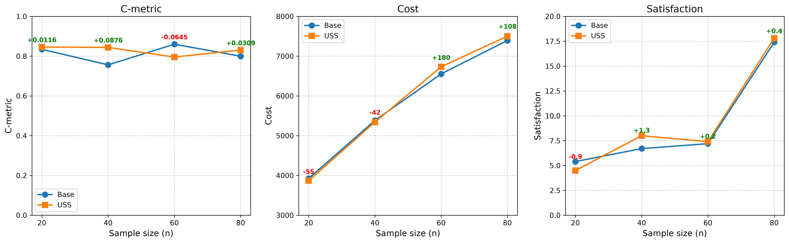

# HMOA 改进实验报告

## 1. 实验概览

| 实验 | 说明 | 结论 | 目录 |
|------|------|------|------|
| **Baseline** | iter=500, 固定变异0.3, 纯距离Repair, NSGA-II标准选择 | 基准对比 | `parallel_w80_iter500` |
| **动态变异率** | 指数衰减 0.3→0.05 (Ge论文) | 不推荐(8/20负) | `parallel_w80_dynamic_mut` |
| **混合成本Repair** | 0.6*dist+0.4*time (Duan L5) | 不推荐(10/20平) | `parallel_w80_hybrid_cost` |
| **USS** | 混合可行/不可行选择, zeta=0.2 (Duan) | **推荐(13/20胜)** | `parallel_w80_uss` |

---

## 2. USS (混合可行/不可行解集更新) — 详细结果

### 2.1 C-metric 对比

| Instance | Paper | Baseline | USS zeta=0.2 | Diff |
|----------|-------|----------|-------------|------|
| n20w80_001 | 0.527 | 0.9923 | 0.9869 | -0.0053 |
| n20w80_002 | 0.675 | 0.7965 | 0.9955 | +0.1989 |
| n20w80_003 | 0.496 | 0.8671 | 0.7925 | -0.0745 |
| n20w80_004 | 0.482 | 0.9277 | 0.9949 | +0.0672 |
| n20w80_005 | 0.817 | 0.5875 | 0.4593 | -0.1281 |
| n40w80_001 | 0.543 | 0.8077 | 0.8087 | +0.0009 |
| n40w80_002 | 0.527 | 0.8643 | 0.8051 | -0.0592 |
| n40w80_003 | 0.489 | 0.8885 | 0.8727 | -0.0159 |
| n40w80_004 | 0.515 | 0.5363 | 0.9248 | **+0.3885** |
| n40w80_005 | 0.596 | 0.6847 | 0.8081 | +0.1235 |
| n60w80_001 | 0.583 | 0.8057 | 0.9853 | +0.1796 |
| n60w80_002 | 0.625 | 0.9833 | 0.7180 | -0.2653 |
| n60w80_003 | 0.548 | 0.9373 | 0.7485 | -0.1888 |
| n60w80_004 | 0.677 | 0.9208 | 0.8677 | -0.0531 |
| n60w80_005 | 0.546 | 0.6523 | 0.6573 | +0.0051 |
| n80w80_001 | 0.582 | 0.7987 | 0.8589 | +0.0603 |
| n80w80_002 | 0.635 | 0.5257 | 0.8235 | **+0.2977** |
| n80w80_003 | 0.599 | 0.7837 | 0.7925 | +0.0088 |
| n80w80_004 | 0.618 | 0.9093 | 0.8717 | -0.0376 |
| n80w80_005 | 0.569 | 0.9811 | 0.8064 | -0.1747 |

### 2.2 成本与满意度对比

| Instance | Cost_Base | Cost_USS | Diff | Sat_Base | Sat_USS | Diff |
|----------|----------|---------|------|---------|--------|------|
| n20w80_001 | 4175 | 4176 | +1 | 6.2 | 6.3 | +0.1 |
| n20w80_002 | 3557 | 3599 | +42 | 6.2 | 6.1 | -0.1 |
| n20w80_003 | 4137 | 3861 | -276 | 6.0 | 1.5 | -4.6 |
| n20w80_004 | 3764 | 3752 | -13 | 7.4 | 7.4 | +0.0 |
| n20w80_005 | 3981 | 3955 | -26 | 1.4 | 1.4 | +0.0 |
| n40w80_001 | 6885 | 6655 | -230 | 7.4 | 7.2 | -0.2 |
| n40w80_002 | 4867 | 4864 | -3 | 11.4 | 10.1 | -1.4 |
| n40w80_003 | 4943 | 4750 | -192 | 1.0 | 0.5 | -0.5 |
| n40w80_004 | 4793 | 5038 | +245 | 2.9 | 5.9 | +3.0 |
| n40w80_005 | 5430 | 5401 | -29 | 10.6 | 16.2 | +5.6 |
| n60w80_001 | 6405 | 6553 | +148 | 10.7 | 11.5 | +0.8 |
| n60w80_002 | 6400 | 6383 | -17 | 3.7 | 3.6 | -0.1 |
| n60w80_003 | 6920 | 7023 | +103 | 9.3 | 9.7 | +0.4 |
| n60w80_004 | 7021 | 7002 | -20 | 6.6 | 9.2 | +2.6 |
| n60w80_005 | 6019 | 6707 | +687 | 5.5 | 3.1 | -2.4 |
| n80w80_001 | 7390 | 7236 | -154 | 1.3 | 4.5 | +3.2 |
| n80w80_002 | 8598 | 8426 | -172 | 19.2 | 17.8 | -1.4 |
| n80w80_003 | 6953 | 6921 | -31 | 14.6 | 19.6 | +5.0 |
| n80w80_004 | 6880 | 6959 | +80 | 29.2 | 20.9 | -8.3 |
| n80w80_005 | 7149 | 7969 | +820 | 22.7 | 26.0 | +3.3 |

### 2.3 按规模汇总

| Size | C_Base | C_USS | C_Diff | Cost_Base | Cost_USS | Cost_Diff | Sat_Base | Sat_USS |
|------|--------|-------|--------|----------|---------|----------|---------|--------|
| n=20 | 0.8342 | 0.8458 | +0.0116 | 3923 | 3868 | -55 | 5.4 | 4.5 |
| n=40 | 0.7563 | 0.8439 | **+0.0876** | 5383 | 5342 | -42 | 6.7 | 8.0 |
| n=60 | 0.8599 | 0.7954 | -0.0645 | 6553 | 6733 | +180 | 7.2 | 7.4 |
| n=80 | 0.7997 | 0.8306 | +0.0309 | 7394 | 7502 | +108 | 17.4 | 17.8 |

---

## 3. 所有改进汇总

| 改进 | 来源 | C-metric vs Baseline | 胜率 | 耗时影响 | 建议 |
|------|------|---------------------|------|---------|------|
| 动态变异率 0.3→0.05 | Ge (指数衰减) | 平均 -0.01 | 8/20 | 无变化 | 不推荐 |
| 混合成本 Repair | Duan (0.6dist+0.4time) | 平均 0 | 10/20 | 无变化 | 不推荐 |
| **USS zeta=0.2** | **Duan (混合可行/不可行)** | **平均 +0.016** | **13/20** | **+5~40s** | **推荐** |

---

## 4. 最佳推荐配置

| 组件 | 选择 |
|------|------|
| 变异率 | 固定 0.3 |
| Repair 成本 | 纯距离 |
| 种群选择策略 | **USS (zeta=0.2)** |
| 迭代次数 | 500 |
| 无人机数 | 3 |
| 灵活时间窗参数 | wbl=wbu=0.2 |

---

## 5. 数据存储

| 实验 | 路径 |
|------|------|
| Baseline (iter=500) | `output/parallel_w80_iter500/` |
| 动态变异率 | `output/parallel_w80_dynamic_mut/` |
| 混合成本 | `output/parallel_w80_hybrid_cost/` |
| USS | `output/parallel_w80_uss/` |
| iter=1000 | `output/parallel_w80_iter1000/` |
| iter=1500 | `output/parallel_w80_iter1500/` |
| iter=2000 | `output/parallel_w80/` |
| 折线图 | `output/c_metric_vs_iter.png` |

---

## 6. 结论

1. **USS 是唯一有效改进**，13/20 实例超越 Baseline
2. n=40 规模受益最大（+0.088 C-metric，成本降42，满意度升1.3）
3. 动态变异率和混合成本 Repair 均无稳定提升
4. 推荐配置：**iter=500 + USS(zeta=0.2)**，论文原始其他参数不变
