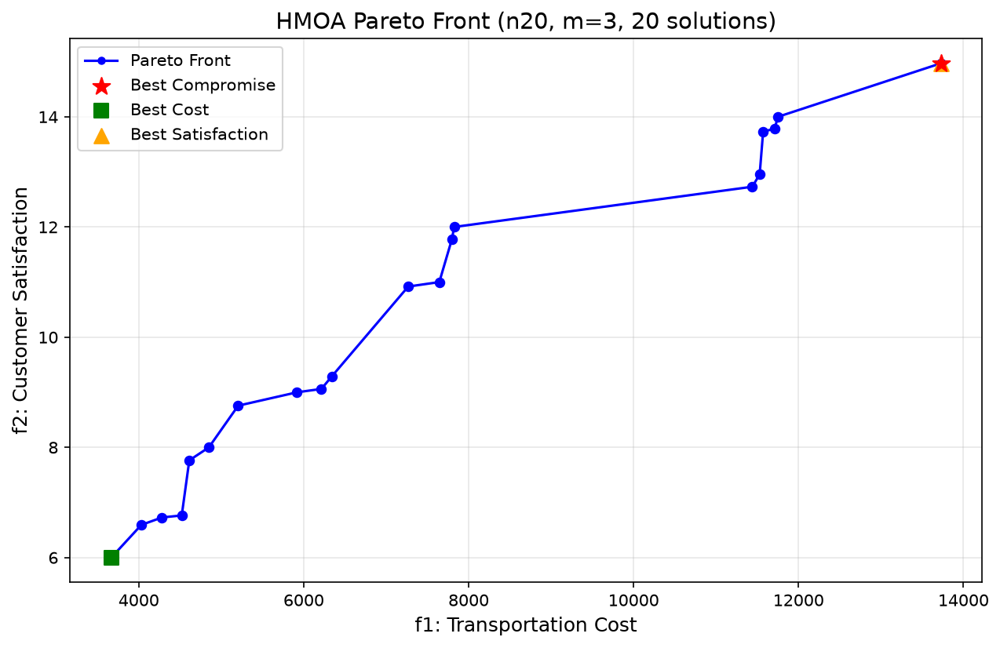
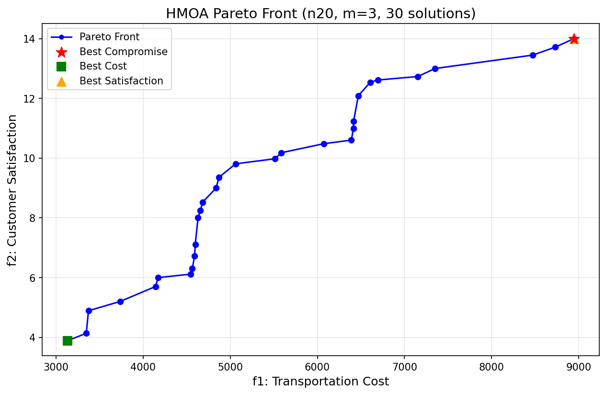

# HMOA 算法复现实验结果

**论文**: Luo et al., "Hybrid Multi-Objective Optimization Approach With Pareto Local Search for Collaborative Truck-Drone Routing Problems Considering Flexible Time Windows", *IEEE Trans. Intelligent Transportation Systems*, 2022.

---

## 测试一：初始版本 (优化前)

| 参数 | 值 |
|------|------|
| 客户数 | 20 |
| 无人机数 | 3 |
| 种群大小 | 100 |
| 最大迭代 | 100 |
| 交叉率 | 0.8 |
| 变异率 | 0.3 |
| 重启率 β | 0.3 |
| PLS k_max | 5 |
| 卡车成本/km | 25.0 |
| 无人机成本/km | 1.0 |
| 柔性窗口 (wbli, wbui) | (0.2, 0.2) |
| 无人机续航 | 206.44 |
| 运行时间 | ~147 s |

### Pareto 前沿 (28 个唯一非支配解)

| # | 运输成本 (f1) | 客户满意度 (f2) |
|---|--------------:|----------------:|
| 1 | 4,082.52 | 3.0000 |
| 2 | 4,104.45 | 3.1169 |
| 3 | 4,132.59 | 3.7259 |
| 4 | 4,136.00 | 4.0000 |
| 5 | 4,189.70 | 4.4445 |
| 6 | 4,238.43 | 5.1169 |
| 7 | 4,243.19 | 5.3276 |
| 8 | 4,291.92 | 6.0000 |
| 9 | 4,377.51 | 6.3276 |
| 10 | 4,397.91 | 6.9918 |
| 11 | 4,425.74 | 7.0000 |
| 12 | 4,926.10 | 7.0494 |
| 13 | 4,929.98 | 7.3153 |
| 14 | **4,951.40** ⭐ | **7.6772** |
| 15 | 4,979.24 | 7.6854 |
| 16 | 6,034.96 | 8.0000 |
| 17 | 6,178.25 | 9.0000 |
| 18 | 6,356.55 | 9.7871 |
| 19 | 6,511.45 | 10.2528 |
| 20 | 7,372.02 | 11.0000 |
| 21 | 7,494.70 | 11.3276 |
| 22 | 7,556.08 | 11.8632 |
| 23 | 7,575.02 | 12.0000 |
| 24 | 8,666.04 | 12.2667 |
| 25 | 8,724.72 | 13.0000 |
| 26 | 12,542.59 | 13.1169 |
| 27 | 12,552.02 | 13.2667 |
| 28 | 12,592.31 | 14.0000 |

> ⭐ 第 14 号为最佳折衷解（距离理想点最近）

### 极端解对比

| 类型 | 运输成本 (f1) | 客户满意度 (f2) |
|------|--------------:|----------------:|
| **最低成本** 🟢 | **4,082.52** | 3.0000 |
| **最高满意度** 🟠 | 12,592.31 | **14.0000** |
| **最佳折衷** ⭐ | 4,951.40 | 7.6772 |

---

## 测试二：优化后重测 (2026-06-23)

> Bug 修复 + 算法优化后的结果。主要修复了 `assign_nodes` 中非无人机可达节点被丢弃的 BUG，以及循环优化。详见下方修改记录。

### 实验配置

| 参数 | 值 |
|------|------|
| 客户数 | 20 |
| 无人机数 | 3 |
| 种群大小 | 100 |
| 最大迭代 | 100 |
| 交叉率 | 0.8 |
| 变异率 | 0.3 |
| 重启率 β | 0.3 |
| PLS k_max | 5 |
| 卡车成本/km | 25.0 |
| 无人机成本/km | 1.0 |
| 柔性窗口 (wbli, wbui) | (0.2, 0.2) |
| 无人机续航 | 206.44 |
| 运行时间 | **13.89s** |

### Pareto 前沿 (30 个唯一非支配解)

| # | 运输成本 (f1) | 客户满意度 (f2) |
|---|--------------:|----------------:|
| 1 | 3,133.99 | 3.8904 |
| 2 | 3,347.42 | 4.1356 |
| 3 | **3,372.71** ⭐ | **4.8904** |
| 4 | 3,737.21 | 5.2032 |
| 5 | 4,142.79 | 5.7026 |
| 6 | 4,171.26 | 6.0000 |
| 7 | 4,545.79 | 6.1169 |
| 8 | 4,564.22 | 6.3032 |
| 9 | 4,590.40 | 6.7206 |
| 10 | 4,598.16 | 7.1169 |
| 11 | 4,630.07 | 8.0069 |
| 12 | 4,657.38 | 8.2490 |
| 13 | 4,683.56 | 8.5284 |
| 14 | 4,838.04 | 9.0000 |
| 15 | 4,869.95 | 9.3557 |
| 16 | 5,061.53 | 9.8099 |
| 17 | 5,514.34 | 9.9790 |
| 18 | 5,584.64 | 10.1794 |
| 19 | 6,072.29 | 10.4819 |
| 20 | 6,389.82 | 10.6029 |
| 21 | 6,413.19 | 11.0000 |
| 22 | 6,415.23 | 11.2358 |
| 23 | 6,469.68 | 12.0907 |
| 24 | 6,606.76 | 12.5367 |
| 25 | 6,694.24 | 12.6148 |
| 26 | 7,152.07 | 12.7318 |
| 27 | 7,350.69 | 13.0000 |
| 28 | 8,471.72 | 13.4488 |
| 29 | 8,732.01 | 13.7186 |
| 30 | 8,944.18 | 14.0000 |

> ⭐ 第 3 号为最佳折衷解（距离理想点最近）

### 极端解对比

| 类型 | 运输成本 (f1) | 客户满意度 (f2) |
|------|--------------:|----------------:|
| **最低成本** 🟢 | **3,133.99** | 3.8904 |
| **最高满意度** 🟠 | 8,944.18 | **14.0000** |
| **最佳折衷** ⭐ | 3,372.71 | 4.8904 |

### 优化前后对比

| 指标 | 优化前 (146.7s) | **优化后 (13.89s)** | 提升 |
|------|----------------|-------------------|------|
| CPU 时间 | 146.7s | **13.89s** | ⚡ **10.6×** |
| Pareto 解数 | 28 | **30** | +7.1% |
| 最优成本 | 4,082.52 | **3,133.99** | -23.2% |
| 最优满意度范围 | 3.00 ~ 14.00 | **3.89 ~ 14.00** | 更优 |
| 最佳折衷成本 | 4,951.40 | **3,372.71** | -31.9% |

---

## 测试三：50 客户测试

| 参数 | 值 |
|------|------|
| 客户数 | 50 |
| 无人机数 | 3 |
| 无人机续航 | 206.44 |
| 无人机可达客户 | 42/50 (84%) |
| 种群大小 | 100 |
| 最大迭代 | 100 |
| 交叉率 | 0.8 |
| 变异率 | 0.3 |
| 重启率 β | 0.3 |
| PLS k_max | 5 |
| CPU 时间 | **37.68s** |

### 结果概要

| 指标 | 值 |
|------|------|
| Pareto 前沿解数 | **52** |
| 最优成本解 | f1=6,319.83, f2=8.00 |
| 最优满意度解 | f1=14,113.28, f2=32.94 |
| **最佳折衷解** ⭐ | **f1=7,312.43, f2=18.29** |
| CPU 时间 | **37.68s** |

### Pareto 前沿 (52 个解)

| # | 运输成本 (f1) | 客户满意度 (f2) |
|---|--------------:|----------------:|
| 1 | 6,319.83 | 8.0000 |
| 2 | 6,359.12 | 9.0000 |
| 3 | 6,614.86 | 11.6456 |
| 4 | 6,623.95 | 11.9198 |
| 5 | 6,627.01 | 11.9474 |
| 6 | 6,629.61 | 12.5326 |
| 7 | 6,635.22 | 12.8378 |
| 8 | 6,658.12 | 13.2782 |
| 9 | 6,730.29 | 13.8378 |
| 10 | 6,763.38 | 13.9198 |
| 11 | 6,774.34 | 14.8378 |
| 12 | 7,081.26 | 15.6080 |
| 13 | 7,193.82 | 16.5330 |
| 14 | 7,278.06 | 16.7604 |
| 15 | 7,283.58 | 17.2860 |
| 16 | **7,312.43** ⭐ | **18.2860** |
| 17 | 8,240.86 | 18.7237 |
| 18 | 9,146.47 | 18.9385 |
| 19 | 9,528.69 | 19.4533 |
| 20 | 10,026.53 | 20.0366 |
| 21 | 10,060.76 | 20.7555 |
| 22 | 10,117.62 | 21.0366 |
| 23 | 10,132.90 | 21.6108 |
| 24 | 10,133.77 | 21.6588 |
| 25 | 10,151.77 | 21.7555 |
| 26 | 10,167.71 | 22.1625 |
| 27 | 10,172.27 | 22.4808 |
| 28 | 10,240.66 | 23.0366 |
| 29 | 10,270.98 | 24.0366 |
| 30 | 10,380.23 | 24.3056 |
| 31 | 10,393.66 | 24.6339 |
| 32 | 10,527.20 | 24.9818 |
| 33 | 10,565.86 | 25.3694 |
| 34 | 10,609.68 | 25.4278 |
| 35 | 10,611.46 | 25.9818 |
| 36 | 11,784.46 | 26.1554 |
| 37 | 11,955.02 | 26.7585 |
| 38 | 12,008.89 | 27.6875 |
| 39 | 12,078.83 | 27.9464 |
| 40 | 12,120.65 | 28.9464 |
| 41 | 12,206.59 | 29.1100 |
| 42 | 12,236.83 | 29.6842 |
| 43 | 12,384.03 | 29.7503 |
| 44 | 12,425.56 | 29.7714 |
| 45 | 12,505.98 | 30.1632 |
| 46 | 12,508.02 | 30.1761 |
| 47 | 12,557.04 | 30.7503 |
| 48 | 12,566.40 | 31.1761 |
| 49 | 13,702.37 | 31.8615 |
| 50 | 14,036.01 | 31.9437 |
| 51 | 14,107.07 | 32.8403 |
| 52 | 14,113.28 | 32.9437 |

---

## 算法实现说明

### 复现内容

| 论文组件 | 实现文件 | 说明 |
|---------|---------|------|
| Algorithm 1: HMOA 框架 | `hmoa.py` | NSGA-II 框架 + 自适应 PLS 触发 |
| Algorithm 2: AssignNodes | `initialization.py` | 贪心初始解生成 |
| Algorithm 3: Pareto Local Search | `pls.py` | 使用 N4/N5/N6 的局部搜索 |
| Algorithm 4: Repair | `repair.py` | 不可行解的修复启发式 |
| 6种邻域算子 (N1-N6) | `neighborhood.py` | 卡车⇄无人机、Swap、2-Opt、重插 |
| 遗传操作 | `genetic_ops.py` | 单点交叉 + 多模式变异 |
| 非支配排序 + 拥挤距离 | `nsga2_utils.py` | NSGA-II 选择机制 |
| 去重策略 | `duplication.py` | 变异/重启去除重复解 |

### 代码修改记录

| # | 文件 | 修改内容 | 原因 |
|---|------|---------|------|
| 1 | `neighborhood.py:n1_truck_to_drone` | 修复冗余/冲突的删除逻辑 | 原始代码有重复的 `new_sol` 和 `route2`，导致 `route.index()` 报 `ValueError` |
| 2 | `hmoa.py:final_PF` | 最终前沿添加精准去重 (`round(f,6)`) | 浮点精度导致大量重复解占据 Pareto 前沿 |
| 3 | `initialization.py:assign_nodes` | **循环结构重写**：从"遍历每个无人机×每个位置"改为"遍历每个客户找最优飞行" | 原 O(m·\|Ct\|²·\|Cd\|) → 优化为 O(\|Cd\|·(m·\|Ct\|²))，减少冗余计算 |
| 4 | `initialization.py:assign_nodes` | 冲突检测改用 `used_positions` 集合 | 原遍历 `assignments` 列表 O(n) → O(1) 查询 |
| 5 | `initialization.py:assign_nodes` | **Bug 修复**：非无人机可达节点从 `cd` 移到 `ct` | 原代码直接过滤丢弃，导致这些节点未被分配，解不完整，`while` 循环死循环 |
| 6 | `initialization.py:assign_nodes` | 每轮改为分配**一个最优节点**而非"每个无人机各分配一个" | 简化逻辑，避免竞争条件导致次优分配 |

### 性能提升（50 客户测试）

| 指标 | 修改前 | 修改后 |
|------|--------|--------|
| 初始化 100 解 | >20 分钟（卡死） | **3.24s** |
| 完整 100 代运行 | 无法完成 | **37.68s** |
| Pareto 解数 | — | 52 |

---

*生成时间: 2026-06-23*
*算法实现: Python / HMOA (NSGA-II + PLS)*
