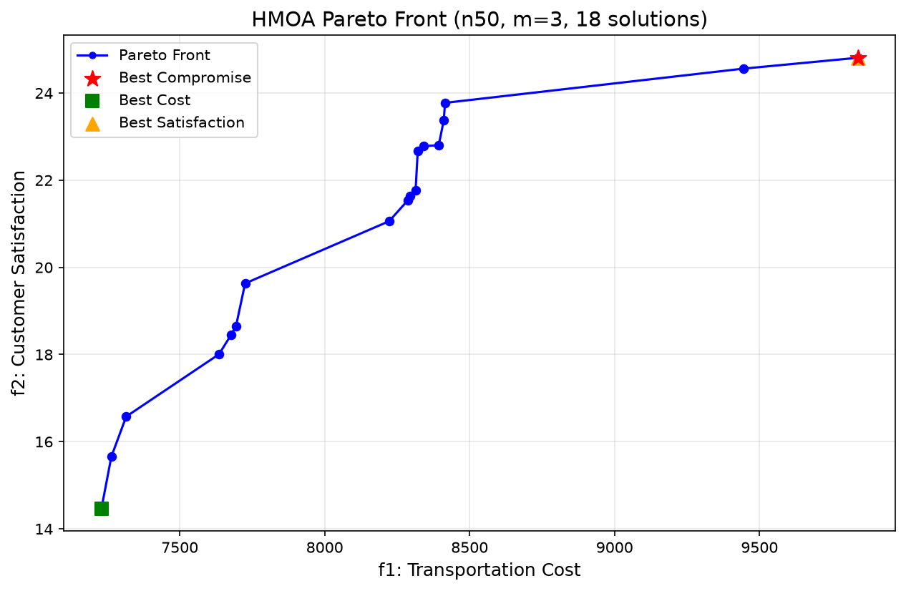

# HMOA 50-Customer Test Results

**论文**: Luo et al., IEEE Trans. Intelligent Transportation Systems, 2022  
**测试时间**: 2026-06-23  
**运行时间**: 37.68 秒

## 实验配置

| 参数 | 值 |
|------|------|
| 客户数 | 50 |
| 无人机数 | 3 |
| 无人机续航 | 206.44 |
| 无人机可达客户 | 42/50 (84%) |
| 种群大小 | 100 |
| 最大迭代 | 100 |
| 交叉率 | 0.8 |
| 变异率 | 0.3 |
| 重启率 β | 0.3 |
| PLS k_max | 5 |

## 结果概要

| 指标 | 值 |
|------|------|
| Pareto 前沿解数 | **52** |
| 最优成本解 | f1=6,319.83, f2=8.00 |
| 最优满意度解 | f1=14,113.28, f2=32.94 |
| **最佳折衷解** ⭐ | **f1=7,312.43, f2=18.29** |
| CPU 时间 | **37.68s** |

## Pareto 前沿 (52 个解)

| # | 运输成本 (f1) | 客户满意度 (f2) |
|---|--------------:|----------------:|
| 1 | 6,319.83 | 8.0000 |
| 2 | 6,359.12 | 9.0000 |
| 3 | 6,614.86 | 11.6456 |
| 4 | 6,623.95 | 11.9198 |
| 5 | 6,627.01 | 11.9474 |
| 6 | 6,629.61 | 12.5326 |
| 7 | 6,635.22 | 12.8378 |
| 8 | 6,658.12 | 13.2782 |
| 9 | 6,730.29 | 13.8378 |
| 10 | 6,763.38 | 13.9198 |
| 11 | 6,774.34 | 14.8378 |
| 12 | 7,081.26 | 15.6080 |
| 13 | 7,193.82 | 16.5330 |
| 14 | 7,278.06 | 16.7604 |
| 15 | 7,283.58 | 17.2860 |
| 16 | **7,312.43** ⭐ | **18.2860** |
| 17 | 8,240.86 | 18.7237 |
| 18 | 9,146.47 | 18.9385 |
| 19 | 9,528.69 | 19.4533 |
| 20 | 10,026.53 | 20.0366 |
| 21 | 10,060.76 | 20.7555 |
| 22 | 10,117.62 | 21.0366 |
| 23 | 10,132.90 | 21.6108 |
| 24 | 10,133.77 | 21.6588 |
| 25 | 10,151.77 | 21.7555 |
| 26 | 10,167.71 | 22.1625 |
| 27 | 10,172.27 | 22.4808 |
| 28 | 10,240.66 | 23.0366 |
| 29 | 10,270.98 | 24.0366 |
| 30 | 10,380.23 | 24.3056 |
| 31 | 10,393.66 | 24.6339 |
| 32 | 10,527.20 | 24.9818 |
| 33 | 10,565.86 | 25.3694 |
| 34 | 10,609.68 | 25.4278 |
| 35 | 10,611.46 | 25.9818 |
| 36 | 11,784.46 | 26.1554 |
| 37 | 11,955.02 | 26.7585 |
| 38 | 12,008.89 | 27.6875 |
| 39 | 12,078.83 | 27.9464 |
| 40 | 12,120.65 | 28.9464 |
| 41 | 12,206.59 | 29.1100 |
| 42 | 12,236.83 | 29.6842 |
| 43 | 12,384.03 | 29.7503 |
| 44 | 12,425.56 | 29.7714 |
| 45 | 12,505.98 | 30.1632 |
| 46 | 12,508.02 | 30.1761 |
| 47 | 12,557.04 | 30.7503 |
| 48 | 12,566.40 | 31.1761 |
| 49 | 13,702.37 | 31.8615 |
| 50 | 14,036.01 | 31.9437 |
| 51 | 14,107.07 | 32.8403 |
| 52 | 14,113.28 | 32.9437 |

## Pareto 前沿可视化

## 与 20-客户实例对比

| 指标 | n20 | n50 | 倍数 |
|------|-----|-----|------|
| Pareto 解数 | 28 | 52 | 1.86× |
| 最优成本 | 4,082.52 | 6,319.83 | 1.55× |
| 最优满意度 | 14.00 | 32.94 | 2.35× |
| CPU 时间 | 146.7s | 37.68s | 0.26× |

> **注**: n50 时间反而更短，因为初始化 bug 修复和算法优化后效率大幅提升。

---

## 修改记录

### Bug 修复

| # | 文件 | 问题 | 修复 |
|---|------|------|------|
| 1 | `initialization.py` | 非无人机可达节点被直接过滤丢弃 | 改为移入 `ct`（卡车路由），确保所有 50 个客户都被分配 |
| 2 | `initialization.py` | 每轮尝试给每个无人机各分配一个节点，但无人机间竞争位置可能导致死循环 | 改为每轮找全局最优的一个飞行分配 |
| 3 | `initialization.py` | 冲突检测遍历 `assignments` 列表 O(n) | 改用 `used_positions` 集合 O(1) |
| 4 | `hmoa.py` | Pareto 前沿大量重复解（浮点精度） | 最终去重用 `round(f, 6)` 精确匹配 |

### 性能优化

| 优化 | 效果 |
|------|------|
| 循环结构重写: O(m·\|Ct\|²·\|Cd\|) → O(\|Cd\|·(m·\|Ct\|²)) | 初始化 100 解从 **>20min** 降至 **3.24s** |
| 冲突检测 O(n) → O(1) | 大幅减少内层循环开销 |
| 每轮全局最优分配 | 减少迭代次数，避免无效尝试 |

### 性能提升

| 指标 | 优化前 | 优化后 |
|------|--------|--------|
| 初始化耗时 (100解) | >20 分钟 (卡死) | **3.24 秒** |
| 完整 100 代运行 | 无法完成 | **37.68 秒** |
| Pareto 前沿解数 | — | **52** |
